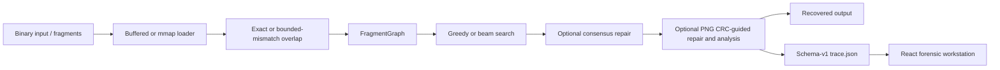

# ShardRecover

ShardRecover is a C++20 binary reconstruction and forensic analysis engine. It builds directional overlap graphs from anonymous fragments, searches candidate reconstruction paths, records mismatch and repair evidence, exports versioned JSON traces, and includes a React workstation for inspecting the result.

## Why

Binary fragments may be unordered, overlapping, duplicated, corrupted, noisy, or missing. ShardRecover makes the evidence and decisions in reconstruction explicit. It cannot recreate arbitrary information that is absent from every surviving fragment, and a complete graph path is not proof that every output byte is correct.

## Architecture



## Core engineering

- Deterministic fixed-size fragmentation with configurable overlap, shuffle, opaque names, duplicates, noise, drops, and byte corruption.
- Directional suffix-prefix overlap. Exact edges satisfy `suffix(A, k) == prefix(B, k)`; approximate edges retain aligned substitution mismatches within a configured budget.
- A directed `FragmentGraph`, where files are nodes and observed overlaps are weighted edges.
- Greedy and beam reconstruction. Beam search retains multiple partial candidates and can use PNG evidence when ranking terminal candidates.
- Consensus-supported byte repair and optional PNG CRC-consistent candidate repair. These are evidence mechanisms, not correctness guarantees.
- Exhaustive construction over `O(N²)` ordered pairs and an exact-mode fingerprint index that filters candidates before full overlap checks.
- Fixed worker-pool graph construction and buffered or memory-mapped fragment access.
- Versioned reconstruction traces containing engine-visible evidence only—never damage-simulator or evaluation ground truth.

## PNG and forensic evidence

The PNG analyzer validates the signature, chunk structure, IHDR semantics, and chunk CRCs. Trace schema v1 records compact chunk metadata, selected-path mismatches, numeric observed byte values, and repair events without fragment payloads. See [the trace schema](docs/trace-schema.md).

## Performance and robustness

The project includes graph and end-to-end recovery benchmarks, 20 CTest targets, 43 frontend tests, ASan/UBSan support, libFuzzer targets with seed corpora, and a reproducible certification script. Bounded fuzzing is evidence for the executed run only; it does not prove absence of defects. See [measured benchmarks](docs/benchmarks.md) and [fuzzing instructions](docs/fuzzing.md).

## Forensic workstation

The React 19 + TypeScript frontend loads local schema-v1 traces in the browser. It visualizes the fragment graph and selected path, distinguishes exact and approximate edges, formats mismatch evidence in hexadecimal, supports join navigation, and exposes reconstruction, repair, timeline, PNG chunk, and CRC evidence. It does not upload traces or require a backend service.

## Build

```sh
cmake -S . -B build -DCMAKE_BUILD_TYPE=Release
cmake --build build --parallel
```

## CLI examples

```sh
./build/shardrecover inspect input.bin

./build/shardrecover fragment input.bin \
  --size 4096 --overlap 512 --shuffle --opaque-names --seed 42 \
  --output fragments

./build/shardrecover reconstruct fragments \
  --strategy beam --beam-width 8 --graph-build indexed --threads 4 \
  --min-overlap 512 --output recovered.bin --trace-json trace.json
```

Run `./build/shardrecover --help` for all implemented options.

## Testing and certification

```sh
./scripts/certify.sh
```

For frontend development:

```sh
cd frontend
npm ci
npm test
npm run build
npm run dev
```

## Scope and limitations

- Missing information with no surviving evidence cannot be reconstructed.
- Approximate overlaps currently model aligned byte substitutions, not arbitrary insertions or deletions.
- Consensus can be biased by duplicate fragment instances.
- CRC consistency narrows candidates but is not proof of the original byte value.
- Trace schema v1 omits raw fragment contents, so the frontend presents mismatch-centric evidence rather than arbitrary byte windows.
- Benchmarks are workload- and machine-specific; indexing or mmap can be slower on small inputs.

## Repository layout

| Path | Purpose |
|---|---|
| `include/shardrecover/`, `src/` | C++ core and public headers |
| `cli/` | Command-line application |
| `tests/` | Native deterministic tests |
| `benchmarks/` | Graph and recovery evaluation harnesses |
| `fuzz/` | libFuzzer targets and corpora |
| `frontend/` | React forensic workstation |
| `docs/` | Trace, benchmark, fuzzing, demo, and release documentation |
| `legacy/ece252_starter/` | Isolated ECE252 course reference material; not linked into active targets |

ShardRecover reports version `0.1.0` through `--version`.
