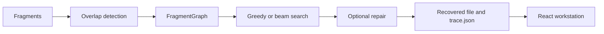

# ShardRecover

ShardRecover is a C++20 engine for reconstructing files from shuffled, overlapping, and damaged binary fragments. It builds a directed overlap graph and searches for a likely reconstruction with either a greedy or beam-search strategy. A React frontend visualizes the exported trace so the graph, chosen path, mismatches, and repairs can be inspected.

## How it works



Each fragment becomes a graph node. A directed edge records a suffix-to-prefix overlap, including its length and any observed byte disagreements. Reconstruction searches this graph for an ordered path and writes both the recovered bytes and, when requested, a versioned JSON trace.

## Highlights

- Exact overlaps and approximate overlaps with a configurable mismatch budget
- Greedy and beam-search reconstruction
- Deterministic fragment generation with overlap, shuffle, opaque names, duplicates, noise, drops, and byte corruption
- Consensus byte repair and optional PNG CRC-guided repair
- Exhaustive or fingerprint-indexed graph construction with a fixed worker pool
- Buffered or memory-mapped fragment input
- PNG structure, chunk, semantic, and CRC analysis
- CTest, frontend tests, ASan/UBSan support, bounded fuzz targets, and benchmark harnesses

## Example

```sh
cmake -S . -B build -DCMAKE_BUILD_TYPE=Release
cmake --build build --parallel

./build/shardrecover fragment input.bin \
  --size 4096 --overlap 512 --shuffle --opaque-names --seed 42 \
  --output fragments

./build/shardrecover reconstruct fragments \
  --strategy beam --beam-width 8 \
  --graph-build indexed --threads 4 --min-overlap 512 \
  --output recovered.bin --trace-json trace.json
```

The CLI also provides `inspect` for a binary preview and `analyze` for examining candidate overlaps. Run `./build/shardrecover --help` for the complete option list.

## Frontend

The frontend reads `trace.json` locally in the browser; it does not upload the trace or require a server. It shows the fragment graph, selected reconstruction path, exact and approximate joins, mismatch bytes, repair events, and PNG evidence. Its timeline is built from completed trace data rather than simulated live progress.

```sh
cd frontend
npm ci
npm run dev
```

Use **Open Trace** to load a trace produced by the CLI.

## Benchmarks and testing

Measured graph, thread-scaling, I/O, and recovery results are in [docs/benchmarks.md](docs/benchmarks.md). The results include both improvements and regressions—for example, indexed discovery performs far fewer full overlap checks on the measured fixture but takes longer overall at that small scale.

Run the complete local certification workflow with:

```sh
./scripts/certify.sh
```

It performs clean Release and sanitizer builds, CTest, bounded fuzzing when the active Clang toolchain supports it, frontend tests and build, trace validation, a byte-for-byte clean reconstruction, and a damaged-input smoke scenario.

## Limitations

- Bytes absent from every surviving fragment cannot be reconstructed.
- Approximate matching handles aligned byte substitutions, not arbitrary insertions or deletions.
- Consensus and CRC consistency can support a repair decision, but they do not guarantee the original byte value.

## More details

- [Measured benchmarks](docs/benchmarks.md)
- [Trace schema](docs/trace-schema.md)
- [Fuzzing and sanitizers](docs/fuzzing.md)
- [Demo walkthrough](docs/demo.md)

`legacy/ece252_starter/` contains isolated course reference material and is not part of the active ShardRecover core.
